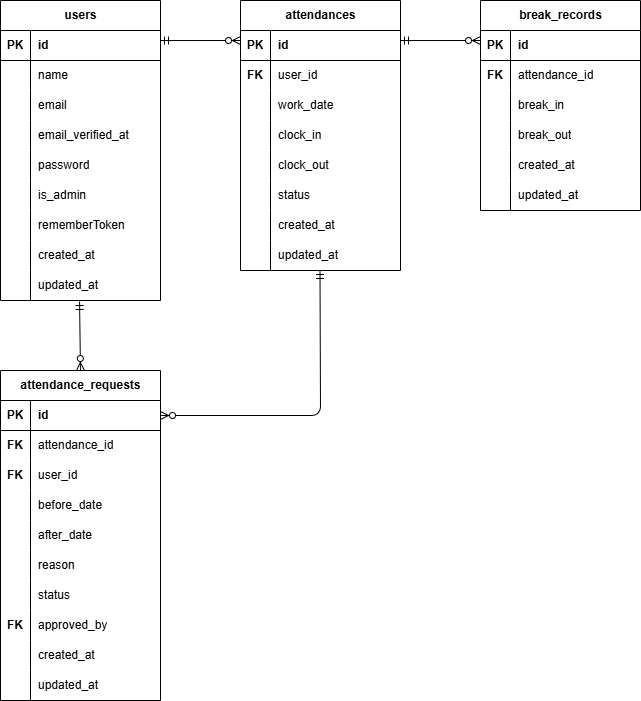

# 勤怠管理アプリ

## 概要

勤怠管理を行うアプリです。
勤務、退勤、休憩のボタンを押すことで勤務時間を計算することが出来ます。

## 環境構築

### ・Dockerビルド

```
git clone git@github.com:saku-taro/sakuda-mogi-kintaikanri.git
```

```
docker-compose up -d --build
```

### ・Laravel環境構築

・プロジェクトのルートディレクトリ（docker-compose.ymlがある場所）へ移動し、以下のコマンドを実行してください。

```
docker-compose exec php bash
```

```
composer install
```

```
cp .env.example .env
```

---

・「.envファイル」の環境変数を次の通り変更する

```
DB_CONNECTION=mysql
DB_HOST=mysql
DB_PORT=3306
DB_DATABASE=laravel_db
DB_USERNAME=laravel_user
DB_PASSWORD=laravel_pass
```

```
php artisan key:generate
```

```
php artisan migrate
```

```
php artisan db:seed
```

### ・ダミーユーザーの情報

---

ユーザー名：

メールアドレス：

```
@example.com
```

パスワード：

```

```

---

### ・テスト環境構築

・プロジェクトのルートディレクトリ（docker-compose.ymlがある場所）へ移動し、以下のコマンドを実行してください。

```
docker-compose exec mysql bash
```

```
mysql -u root -p
```

※パスワードを要求されるため、docker-compose.ymlファイルのMYSQL_ROOT_PASSWORD:に設定されているパスワードを入力する。

```
CREATE DATABASE demo_test;
```

※次のコマンドで「demo_test」が作成されているか確認

```
SHOW DATABASES;
```

※プロジェクトのルートディレクトリへ戻る

```
docker-compose exec php bash
```

```
cp .env .env.testing
```

---

※「.env.testing」の環境変数を次の通り変更する

```
APP_NAME=Laravel
APP_ENV=test
APP_KEY=
APP_DEBUG=true
APP_URL=http://localhost
```

```
DB_CONNECTION=mysql_test
DB_HOST=mysql
DB_PORT=3306
DB_DATABASE=demo_test
DB_USERNAME=root
DB_PASSWORD=root
```

---

```
php artisan key:generate --env=testing
```

```
php artisan migrate --env=testing
```

```
php artisan test
```

## 使用技術(実行環境)

・PHP 8.5.3  
・Laravel 8.83.8  
・MySQL 8.0.26  
・nginx 1.21.1  
・mailhog

## URL

・商品一覧画面(トップ画面)：http://localhost/  
・会員登録画面：http://localhost/register  
・ログイン画面：http://localhost/login  
・phpMyAdmin：http://localhost:8080/

## ER図


